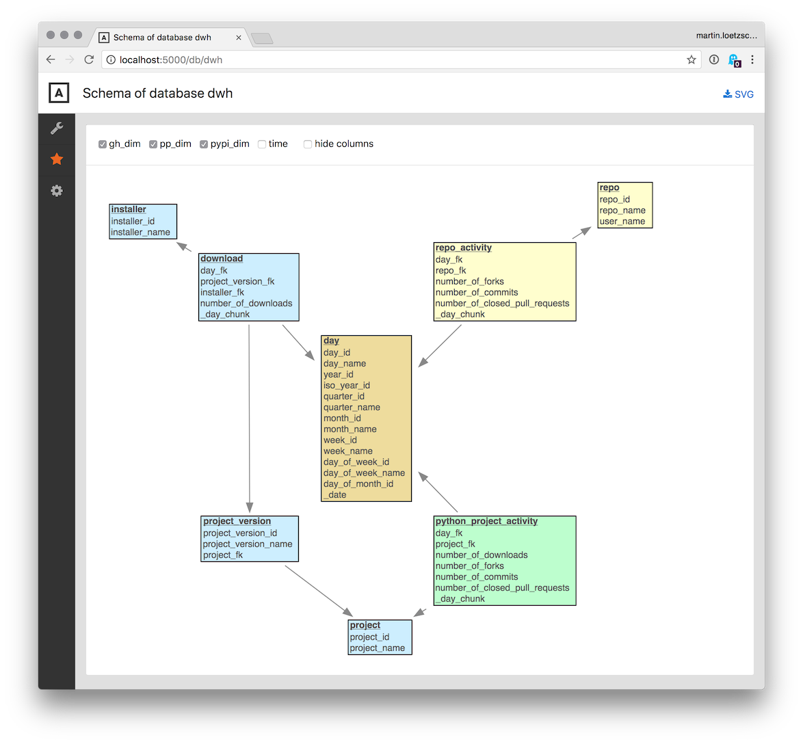
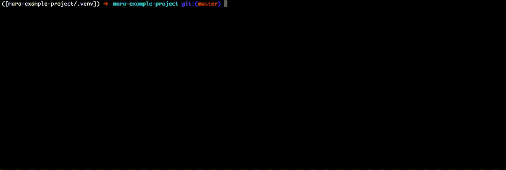
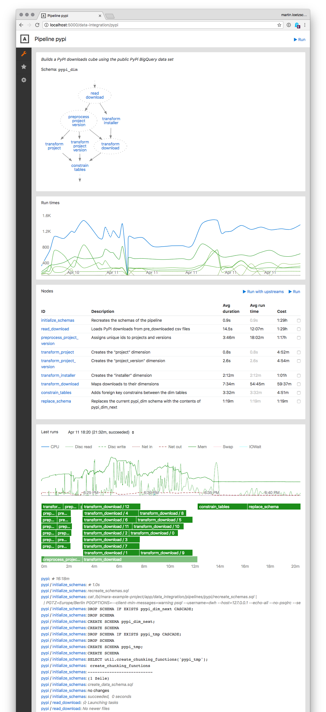
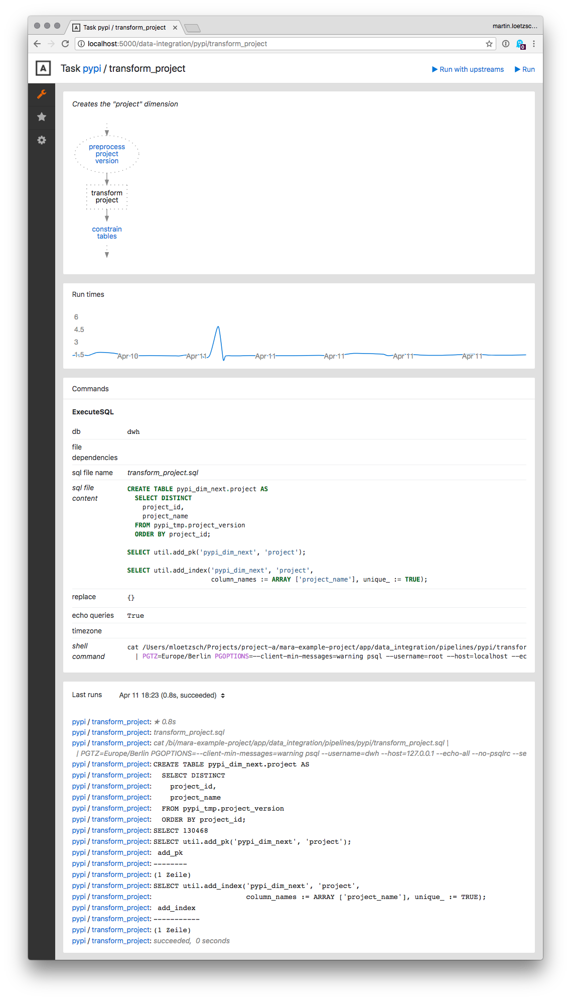

# Mara Example Project

A runnable app that demonstrates how to build a data warehouse with mara. Combines the [data-integration](https://github.com/mara/data-integration) and [bigquery-downloader](https://github.com/mara/bigquery-downloader) libraries with the [mara-app](https://github.com/mara/mara-app) framework into a project. 

The example ETL integrates PyPi download stats and GitHub repo activitiy metrics into more general Python project activity stats.

The repository is intended to serve as a template for new projects.

&nbsp;


## Example: Python Project Stats

The project uses two data sources: 

1. The [PyPI downloads](https://packaging.python.org/guides/analyzing-pypi-package-downloads/) BigQuery data set at [https://bigquery.cloud.google.com/dataset/the-psf:pypi](https://bigquery.cloud.google.com/dataset/the-psf:pypi) (Google login required). It contains each individual package download together with project and client attributes. 

2. The [Github archive](https://www.gharchive.org/) BigQuery data set at [https://bigquery.cloud.google.com/dataset/githubarchive:day](https://bigquery.cloud.google.com/dataset/githubarchive:day). It contains nearly all events that happen to Github repositories.

From both data sources, a set of pre-aggregated and filtered CSVs is incrementally downloaded using the queries in [app/bigquery_downloader](app/biqquery_downloader):

```console
$ gunzip --decompress --stdout data/2018/04/10/pypi/downloads-v1.csv.gz | grep "\tflask\t\|day_id" | head -n 11
day_id	project	project_version	python_version	installer	number_of_downloads
20180410	flask	0.1		bandersnatch	1
20180410	flask	0.2		bandersnatch	1
20180410	flask	0.5		bandersnatch	1
20180410	flask	0.6		bandersnatch	1
20180410	flask	0.8		bandersnatch	1
20180410	flask	0.9		bandersnatch	1
20180410	flask	0.10	2.6	pip	1
20180410	flask	0.11		Browser	1
20180410	flask	0.11		bandersnatch	1
20180410	flask	0.5.1		bandersnatch	1
```

```console
$ gunzip --decompress --stdout data/2018/04/10/github/repo-activity-v1.csv.gz | grep "\tflask\t\|day_id"
day_id	user	repository	number_of_forks	number_of_commits	number_of_closed_pull_requests
20180410	liks79	flask	1		
20180410	dengyifan	flask		1	
20180410	xeriok18600	flask		1	
20180410	manhhomienbienthuy	flask		10
20180410	davidism	flask		49	
20180410	pallets	flask	10	6	3
```

The total size of these (compressed) csv files is 3.5GB for the time range from Jan 2017 to April 2018.

&nbsp;

Then there is the ETL in [app/data_integration/pipelines](app/data_integration/pipelines) that transforms this data into a classic Kimball-like [star schema](https://en.wikipedia.org/wiki/Star_schema):



It shows 4 database schemas, each created by a different pipeline: 

- `time`: All days from the beginning of data processing until yesterday,
- `pypi_dim`: PyPI download counts per project version, installer and day,
- `gh_dim`: The number of commits, forks and closed pull requests per Github repository and day,
- `pp_dim`: PyPI and Github metrics merged by day and repository/ project name.

The overall database size of the data warehouse is roughly 100GB for the timerange mentioned above. 

&nbsp;

With this structure in place, it is then possible to run queries like this:

```sql
SELECT 
  _date, project_name, number_of_downloads, number_of_forks, 
  number_of_commits, number_of_closed_pull_requests 
FROM pp_dim.python_project_activity 
  JOIN pypi_dim.project ON project_id = project_fk 
  JOIN time.day ON day_fk = day_id 
WHERE project_name = 'flask' 
ORDER BY day_fk DESC 
LIMIT 10;
```

```
   _date    | project_name | number_of_downloads | number_of_forks | number_of_commits | number_of_closed_pull_requests 
------------+--------------+---------------------+-----------------+-------------------+--------------------------------
 2018-04-10 | flask        |               45104 |              11 |                67 |                              3
 2018-04-09 | flask        |               57177 |              13 |                45 |                              4
 2018-04-08 | flask        |               70392 |              13 |                 7 |                               
 2018-04-07 | flask        |               65060 |              10 |                 7 |                               
 2018-04-06 | flask        |               70779 |               7 |                11 |                              2
 2018-04-05 | flask        |               62215 |               6 |                22 |                               
 2018-04-04 | flask        |               33116 |              11 |                23 |                               
 2018-04-03 | flask        |               39248 |              15 |                27 |                               
 2018-04-02 | flask        |               54517 |              14 |                17 |                               
 2018-04-01 | flask        |               68685 |               4 |                 6 |                               
(10 rows)
```

&nbsp;

Mara data integration pipelines are visualized and debugged though a web ui. Here, the pipeline `github` is run (locally on an old Mac with 2 days of data): 


&nbsp;

On production, pipelines are run through a cli interface:



&nbsp;

Mara ETL pipelines are compeletely transparent, both to stakeholders in terms of applied business logic and to data engineers in terms of runtime behavior.

This is the page in the web ui that visualizes the pipeline `pypi`: 



It shows 

- a graph of all pipeline children with dependencies between them,
- run times of the pipeline and top child nodes over time,
- a list of all child nodes with their average run time and cost,
- system statistics, a timeline and output of the last runs.

&nbsp;

Similarly, this the page for the task `pypi/transform_project`:



It shows its

- direct upstreams and downstreams,
- run times over time,
- all commands of the task,
- system statistics, a timeline and output of the last runs. 

&nbsp;

## Installation

Python and PostgreSQL are the main requirements of the project. 
They can be run via [Docker](#running-python-and-postgresql-via-docker) or installed [natively](#installing-python-and-postgresql-natively).


### Running Python and PostgreSQL via Docker

Requirements: `docker`, `docker-compose`

Build the images, create and start the containers:

```console
$ MARA_PROJECT_NAME=mara-example docker-compose up --build
```

If the images are already built, then a simple `docker-compose up` will start the containers.

This will:
- create the `mara-postgres:mara-example-dev` and the `mara-app:mara-example-dev` images
- expose and serve a postgres instance at port 5432
- create a bind-mount of the application's codebase in order to avoid re-building in changes happening at the host
- create a named docker volume for managing the postgres db data
- Keep the `mara-app` container alive in developing mode after building by overwriting the default container's command in docker-compose

A custom container name is required for running multiple projects out of the same image by
setting the required environment variable ```MARA_PROJECT_NAME```.
This can be set as part of the `docker-compose` commands or 
alternatively in a `.env` file (see [`.env.example`](.env.example)).
Default value is `mara-example`.

In order to gain access in the `mara-app` running container terminal, run:

```console
# For the mara-app container
$ docker exec -it mara-app zsh
```

The following example highlights how to access the Postgres database data (docker named volume) and log files from host:

```console
# Access PostgreSQL through the psql client

# From inside the container
$ psql -h mara-example-postgres -p 5432 -U postgres

# From host
$ psql -h localhost -p 5432 -U postgres

# View all docker volumes and retrieve the name of the Postgres data one
$ docker volume ls

# Output
DRIVER              VOLUME NAME
local               mara-example-project_mara-postgres-data

# Inspect named docker volume
Postgres data is stored in the path defined by the "Mountpoint" entry of the inspect command output
$ docker volume inspect mara-example-project_mara-postgres-data

# Output
[
    {
        "CreatedAt": "2020-02-24T12:17:24+01:00",
        "Driver": "local",
        "Labels": {
            "com.docker.compose.project": "mara-example-project",
            "com.docker.compose.version": "1.23.1",
            "com.docker.compose.volume": "mara-postgres-data"
        },
        "Mountpoint": "/var/lib/docker/volumes/mara-example-project_mara-postgres-data/_data",
        "Name": "mara-example-project_mara-postgres-data",
        "Options": null,
        "Scope": "local"
    }
]

# Access Postgres query log
sudo tail -f /var/lib/docker/volumes/mara-example-project_mara-postgres-data/_data/log/query.log
```

&nbsp;

### Installing Python and PostgreSQL natively

#### System requirements

Python >=3.6 and PostgreSQL >=10 and some smaller packages are required to run the example (and mara in general). 

Mac:

```console
$ brew install -v python3
$ brew install -v dialog
$ brew install -v coreutils
$ brew install -v graphviz
```

Ubuntu 16.04:

```console
$ sudo apt install git dialog coreutils graphviz python3 python3-dev python3-venv
```

&nbsp;

Mara does not run on Windows natively.

&nbsp;

On Mac, install Postgresql with `brew install -v postgresql`. On Ubuntu, follow  [these instructions](https://www.postgresql.org/download/linux/ubuntu/). Also, install the [cstore_fdw](https://github.com/citusdata/cstore_fdw) with `brew install cstore_fdw` and [postgresql-hll](https://github.com/citusdata/postgresql-hll) extensions from source.

To optimize PostgreSQL for ETL workloads, update your postgresql.conf along [this example](docs/postgresql.conf).

Start a database client with `sudo -u postgres psql postgres` and then create a user with `CREATE ROLE root SUPERUSER LOGIN;` (you can use any other name).

#### Installation

Clone the repository somewhere. Copy the file [`app/local_setup.py.example`](app/local_setup.py.example) to `app/local_setup.py` and adapt to your machine.
In case of missing, `app/local_setup.py` will be created during the initialization of the application.

Log into PostgreSQL with `psql -u root postgres` and create two databases (If the Docker setup is used, the databases and roles are created as part of the build and defined in the [`.scripts/docker/postgres/initdb.sql`](.scripts/docker/postgres/initdb.sql) file):

```sql
CREATE DATABASE example_project_dwh;
CREATE DATABASE example_project_mara;
```

&nbsp;

## Running the web UI

Hit `make` in the root directory of the project. This will 

- create a virtual environment in `.venv`,
- install all packages from [`requirements.txt.freeze`](requirements.txt.freeze) (if you want to create a new `requirements.txt.freeze` from [`requirements.txt`](requirements.txt), then run `make update-packages`),
- create a number of tables that are needed for running mara.

You can now activate the virtual environment with 

```console
$ source .venv/bin/activate
```

To list all available flask cli commands, run `flask` without parameters.

In order to start the Flask application, run:

```console
$ make run-flask
```

The app is now accessible at [http://localhost:5000](http://localhost:5000).

&nbsp;

### Downloading PyPI and Github data from BigQuery

This step takes many hours to complete. If you don't have time for this (or don't want to go through the hassle of creating Google Cloud credentials), we provide a daily updated copy of the result data sets on s3. You can get (and update) the set of result CSVs with 

```console
$ make sync-bigquery-csv-data-sets-from-s3
```

&nbsp;

To download the data yourself, follow the instructions in the README of the [mara/bigquery-downloader](https://github.com/mara/bigquery-downloader) package to get a Google Cloud credentials file. Store it in `app/bigquery_downloader/bigquery-credentials.json`. 

Then run the downloader in an activated virtual environment with:

```
$ flask bigquery_downloader.download_data
```

&nbsp;

### Running the ETL

For development, it is recommended to run the ETL from the web UI (see above). On production, use `flask data_integration.ui.run` to run a pipeline or a set of its child nodes. 

The command `data_integration.ui.run_interactively` provides an ncurses-based menu for selecting and running pipelines.

&nbsp;

## Documentation

Documentation is work in progress. But the code base is quite small and documented.
